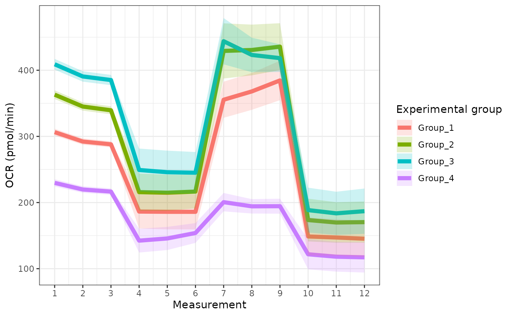
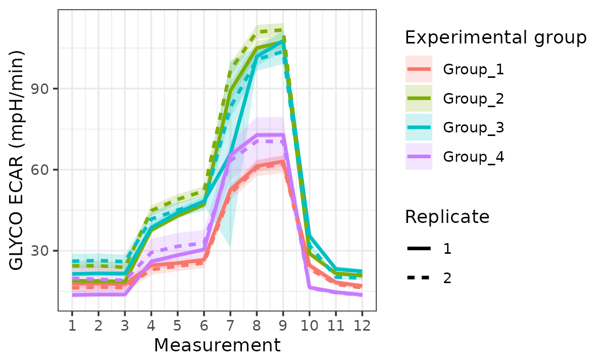
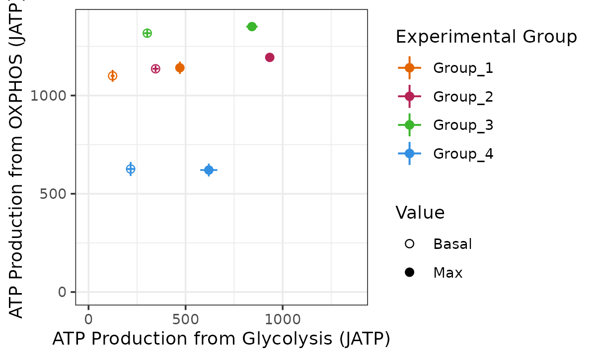
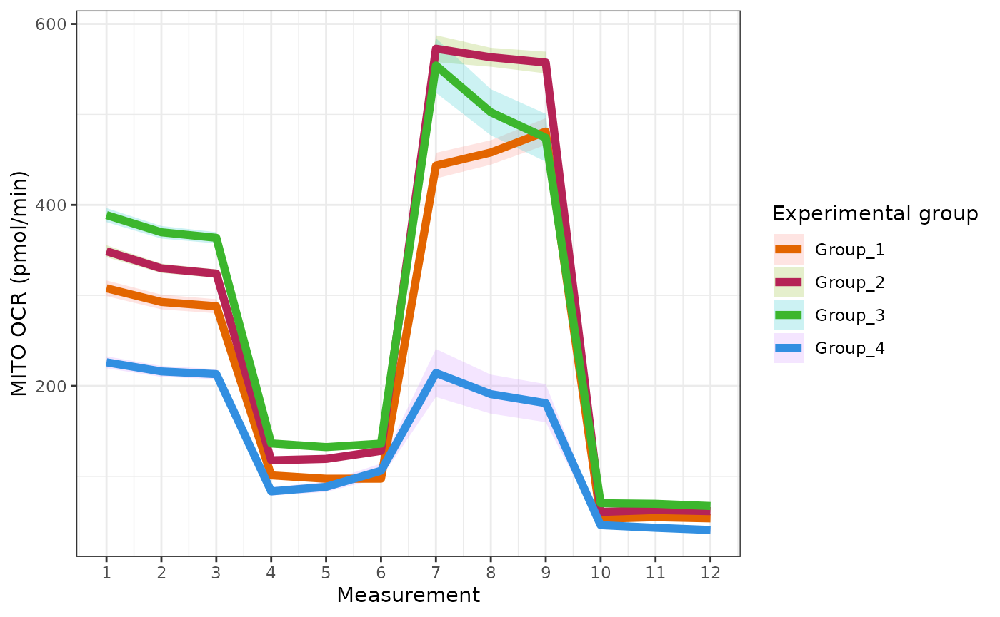
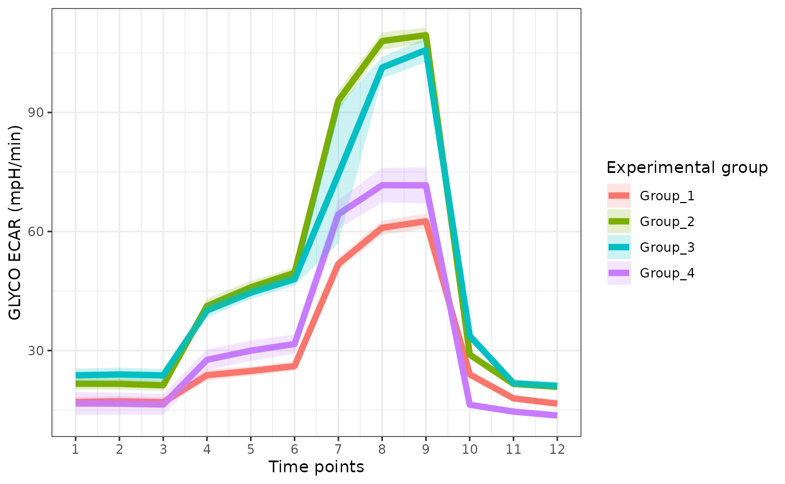
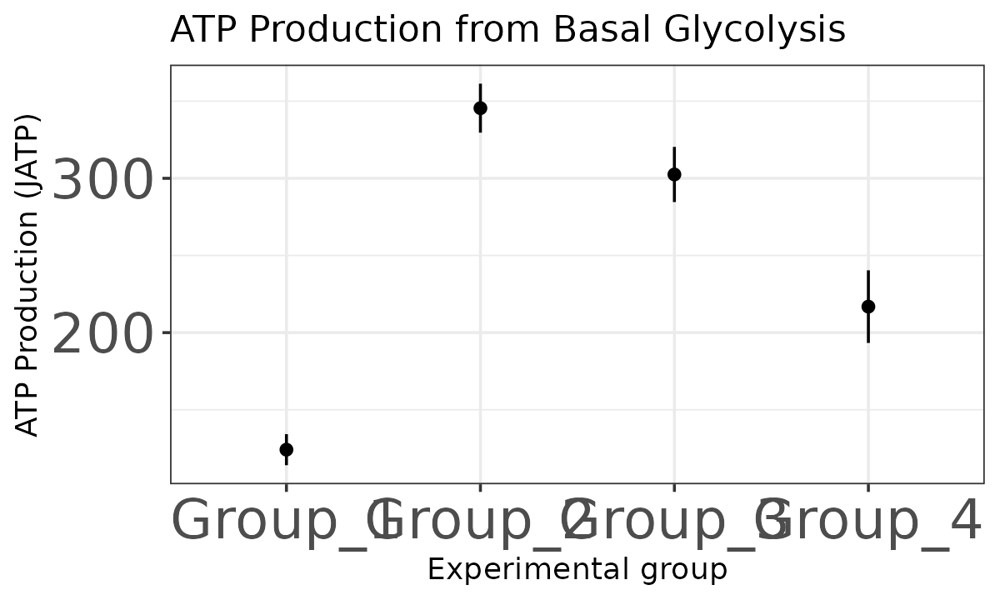

# Getting started with CEAS

## Setup

``` r
library(ceas)
```

## Importing Seahorse rates data

The read_data function imports a list of Wave excel export file(s),
meaning it will import all `.xlsx` files from a common directory. With
that, the user should organize the file(s) they wish to analyze in a
single directory (folder). This directory can also contain the
normalization CSV file (see [Normalization](#normalization)). An easy
way to get such a list is to put all your data in a directory and list
its contents. For example, if your data is in a directory called
“seahorse_data”:

``` r
rep_list <- list.files("seahorse_data", pattern = "*.xlsx", full.names = TRUE)
```

In this vignette we use the package’s internal datasets:

``` r
rep_list <- system.file("extdata", package = "ceas") |>
  list.files(pattern = "*.xlsx", full.names = TRUE)
raw_data <- readxl::read_excel(rep_list[1], sheet = 2)
knitr::kable(head(raw_data))
```

| Measurement | Well | Group        |     Time |      OCR |     ECAR |      PER |
|------------:|:-----|:-------------|---------:|---------:|---------:|---------:|
|           1 | A01  | Background   | 1.304765 |   0.0000 |  0.00000 |   0.0000 |
|           1 | A02  | Group_1 MITO | 1.304765 | 305.2426 | 30.64529 | 334.4771 |
|           1 | A03  | Group_1 MITO | 1.304765 | 307.9862 | 33.27668 | 358.4754 |
|           1 | A04  | Group_2 MITO | 1.304765 | 339.3399 | 49.17751 | 503.4910 |
|           1 | A05  | Group_2 MITO | 1.304765 | 321.9398 | 47.94602 | 492.2597 |
|           1 | A06  | Group_2 MITO | 1.304765 | 323.7962 | 46.84232 | 482.1940 |

The data requires the following columns: Measurement, Well, Group, Time,
OCR, ECAR, PER. The `Group` column needs to be in the format
`biological_group<delimiter>Assay_type` (with `<space>` as the default
delimiter) as shown above. Upon reading with `read_data`, the `Group`
column is split into two at the delimiter character and used to populate
the `group` and `assay` columns. This output format can be set in the
Seahorse machine before starting the experiment. The user can choose to
either

- name their wells according to the *ceas* format on the Wave software
  or

- manually rename each Group in the Wave excel output before importing
  via `read_data.` If you already have the data, this column will have
  to be converted to this format to work with *ceas*.

``` r
seahorse_rates <- read_data(rep_list)
knitr::kable(head(seahorse_rates))
```

| Measurement | Well |     Time |      OCR |     ECAR |      PER | exp_group  | assay_type | replicate |
|------------:|:-----|---------:|---------:|---------:|---------:|:-----------|:-----------|:----------|
|           1 | A01  | 1.304765 |   0.0000 |  0.00000 |   0.0000 | Background | NA         | 1         |
|           1 | A02  | 1.304765 | 305.2426 | 30.64529 | 334.4771 | Group_1    | MITO       | 1         |
|           1 | A03  | 1.304765 | 307.9862 | 33.27668 | 358.4754 | Group_1    | MITO       | 1         |
|           1 | A04  | 1.304765 | 339.3399 | 49.17751 | 503.4910 | Group_2    | MITO       | 1         |
|           1 | A05  | 1.304765 | 321.9398 | 47.94602 | 492.2597 | Group_2    | MITO       | 1         |
|           1 | A06  | 1.304765 | 323.7962 | 46.84232 | 482.1940 | Group_2    | MITO       | 1         |

### Normalization

There are two types of normalization involved in Seahorse data analysis.
The first type of normalization is background normalization, which is
typically performed within in the Seahorse Wave software. If the
Seahorse data has been background normalized, the “Background” wells
should have OCR and ECAR values of 0. *ceas* will flag the user with a
warning if the “Background” OCR and ECAR values are not 0 (see first row
of the table above).

The second type of normalization is sample normalization, which can be
performed using *ceas*. Example sample normalization measures include
cell count per well and \\\mu\\g of protein per well. Sample
normalization using *ceas* requires an additional CSV file containing
two columns:

1.  `"exp_group"` or `"well"`

2.  experimental measure values (e.g. cell counts) in this format:

``` r
norm_csv <- system.file("extdata", package = "ceas") |>
  list.files(pattern = "norm.csv", full.names = TRUE)
norm_csv
#> [1] "/home/runner/work/_temp/Library/ceas/extdata/norm.csv"     
#> [2] "/home/runner/work/_temp/Library/ceas/extdata/well_norm.csv"
exp_group_norm <- norm_csv[1]
well_norm <- norm_csv[2]

read.csv(exp_group_norm) |>
    knitr::kable(caption = "For normalizing by experimental group")
```

| exp_group | measure |
|:----------|--------:|
| Group_1   |   30000 |
| Group_2   |   30000 |
| Group_3   |    5000 |
| Group_4   |    5000 |

For normalizing by experimental group

``` r
read.csv(well_norm) |> head() |>
    knitr::kable(caption = "For normalizing by well")
```

| Well | measure |
|:-----|--------:|
| A01  |       0 |
| A02  |    5000 |
| A03  |    5500 |
| A04  |    5300 |
| A05  |    4500 |
| A06  |    5900 |

For normalizing by well

For sample normalization *ceas* can use one of two normalizing methods
according to the provided `norm_method` argument:

- `"self"`: for each experimental group or well, the rows of the
  Seahorse data are divided by the corresponding `measure` value. Each
  OCR, ECAR, and PER value is divided by the measure it”self”. OCR and
  ECAR values are divided by the corresponding raw value in the
  “measure” column. This can be thought of as an intra-well/experimental
  group normalization. Each normalized value is then interpreted as
  pmol/min per cell or pmol/min per g of protein.

- `"minimum"`: When set to `"minimum"`, each OCR, ECAR, and PER value is
  normalized by the minimum value in the `norm_csv` “measure” column. In
  this method, every “measure” column’s value in the provided CSV file
  is divided by the lowest of the “measure” values to get a
  normalization factor for each well or experimental group. The OCR,
  ECAR, and PER values in each well or experimental group are divided by
  their corresponding normalization factors. Compared to `"self"`, this
  can be thought of as an inter-well/experimental group normalization
  based on the lowest `"measure"`. The results may be interpreted as
  pmol/min per minimum of the group cell count or g of protein.

Your normalization CSV file path may be passed into
[`read_data()`](https://jamespeapen.github.io/ceas/dev/reference/read_data.md)
using the `norm` argument along with `norm_column` with either
`"exp_group"` or `"well"` and `norm_method` as either `"self"` or
`"minimum"`.

**Note**: it is important to minimize sample variability during your
Seahorse experiment.

``` r
read_data(
    rep_list,
    norm = exp_group_norm,
    norm_column = "exp_group",
    norm_method = "self"
) |> head() |> knitr::kable()
```

| Measurement | Well |     Time |       OCR |      ECAR |       PER | exp_group  | assay_type | replicate |
|------------:|:-----|---------:|----------:|----------:|----------:|:-----------|:-----------|:----------|
|           1 | A01  | 1.304765 | 0.0000000 | 0.0000000 | 0.0000000 | Background | NA         | 1         |
|           1 | A02  | 1.304765 | 0.0101748 | 0.0010215 | 0.0111492 | Group_1    | MITO       | 1         |
|           1 | A03  | 1.304765 | 0.0102662 | 0.0011092 | 0.0119492 | Group_1    | MITO       | 1         |
|           1 | A04  | 1.304765 | 0.0113113 | 0.0016393 | 0.0167830 | Group_2    | MITO       | 1         |
|           1 | A05  | 1.304765 | 0.0107313 | 0.0015982 | 0.0164087 | Group_2    | MITO       | 1         |
|           1 | A06  | 1.304765 | 0.0107932 | 0.0015614 | 0.0160731 | Group_2    | MITO       | 1         |

## Calculating energetics

### Partitioning data

**Note:**  
When we use the term ‘max’ in the package documentation we mean the
maximal experimental OCR and ECAR values rather than absolute biological
maximums.

The energetics calculation workflow involves partitioning the data into
its time point and assay intervals.

``` r
partitioned_data <- partition_data(seahorse_rates)
```

#### Alternative data formats

The default
[`partition_data()`](https://jamespeapen.github.io/ceas/dev/reference/partition_data.md)
parameters are set to analyze (1) Mito Stress Test and (2) Glycolysis
Stress Test assays run in parallel in the same experiment. The
`assay_types` list parameter can be modified to account for alternative
experiments (e.g. just a Mito Stress Test assay).

- Mito + Glyco (our default)
- Data in the form of Mookerjee et al. ([2017](#ref-mookerjee2017))
- Just Mito
- Respiratory control ratio (RCR) and glycolytic capacity (GC) assay

``` r
partitioned_data <- partition_data(
  seahorse_rates,
  assay_types = list(
    basal = "MITO",
    uncoupled = "MITO",
    maxresp = "MITO",
    nonmito = "MITO",
    no_glucose_glyc = "GLYCO",
    glucose_glyc = "GLYCO",
    max_glyc = "GLYCO"
  ),
  basal_tp = 3,
  uncoupled_tp = 6,
  maxresp_tp = 8,
  nonmito_tp = 12,
  no_glucose_glyc_tp = 3,
  glucose_glyc_tp = 6,
  max_glyc_tp = 8
)
```

``` r
partitioned_data <- partition_data(
  seahorse_rates,
  assay_types = list(
    basal = "RefAssay",
    uncoupled = "RefAssay",
    maxresp = NA,
    nonmito = "RefAssay",
    no_glucose_glyc = "RefAssay",
    glucose_glyc = "RefAssay",
    max_glyc = NA
  ),
  basal_tp = 5,
  uncoupled_tp = 10,
  nonmito_tp = 12,
  maxresp = NA,
  no_glucose_glyc_tp = 1,
  glucose_glyc_tp = 5,
  max_glyc = NA
)
```

``` r
partitioned_data <- partition_data(
  seahorse_rates,
  assay_types = list(
    basal = "MITO",
    uncoupled = "MITO",
    maxresp = "MITO",
    nonmito = "MITO",
    no_glucose_glyc = NA,
    glucose_glyc = "MITO",
    max_glyc = NA
  ),
  basal_tp = 3,
  uncoupled_tp = 6,
  maxresp_tp = 8,
  nonmito_tp = 12,
  no_glucose_glyc_tp = NA,
  glucose_glyc_tp = 3,
  max_glyc_tp = NA
)
```

``` r
partitioned_data <- partition_data(
  seahorse_rates,
  assay_types = list(
    basal = "RCR",
    uncoupled = "RCR",
    maxresp = "RCR,"
    nonmito = "RCR",
    no_glucose_glyc = NA,
    glucose_glyc = "GC",
    max_glyc = "GC"
  ),
  basal_tp = 3,
  uncoupled_tp = 6,
  maxresp_tp = 8,
  nonmito_tp = 12,
  no_glucose_glyc = NA,
  glucose_glyc_tp = 3,
  max_glyc_tp = 9
)
```

#### 

Note that the time point parameters (`maxresp_tp` and
`no_glucose_glyc_tp`) also need to be changed accordingly.

The `get_energetics` function requires pH, pK\\\_a\\ and buffer values.

``` r
energetics <- get_energetics(partitioned_data, ph = 7.4, pka = 6.093, buffer = 0.10)
```

For more information on the calculations see the article on [ATP
calculations](https://jamespeapen.github.io/ceas/dev/articles/atp_calculation.md).

## Plotting

### Bioenergetic scope plot

The `bioscope_plot` function plots a 2D representation of group
“bioenergetic scope.” Bioenergetic scope describes the theoretical
energetic space in which a matrix operates. The bioenergetic scope
coordinates are JATP from OXPHOS on the y-axis and JATP from glycolysis
on the x-axis. The points represent mean basal and/or max JATP from
OXPHOS and glycolysis and the vertical and horizontal lines represent
the standard deviation or confidence interval of JATP from OXPHOS or
glycolysis, respectively.

- Replicates combined
- Replicates as random effects
- Replicates separated

``` r
bioscope <- bioscope_plot(
  energetics,
  model = "ols",
  sep_reps = FALSE
)
bioscope
#> Ignoring unknown labels:
#> • linetype : "Replicate"
```


Bioenergetic scope with replicates combined

``` r
bioscope_plot(energetics, sep_reps = FALSE, model = "mixed")
```


Bioenergetic scope based on a mixed-effects model with replicates as
random effect

``` r
bioscope_plot(energetics, sep_reps = TRUE, model = "ols")
#> Ignoring unknown labels:
#> • linetype : "Replicate"
```


Bioenergetic scope with replicates separated

### Rate plots

The `rate_plot` function provides an overview of OCR or ECAR for each
assay type over time, which enables cross-group energetic comparisons
before and after the addition of energetic-modulating compounds. The
`rate_plot` line represents mean group OCR or ECAR over the sequential
measurements (x-axis) and the shaded variance region represents standard
deviation or specified confidence interval.

#### Oxygen consumption rate (OCR)

- Replicates combined
- Replicates as random effects
- Replicates separated

``` r
ocr <- rate_plot(
  seahorse_rates,
  measure = "OCR",
  assay = "MITO",
  model = "ols",
  sep_reps = FALSE
)
ocr
#> Ignoring unknown labels:
#> • linetype : "Replicate"
```



OCR with replicates combined

``` r
rate_plot(
  seahorse_rates,
  measure = "OCR",
  assay = "MITO",
  model = "mixed",
  sep_reps = FALSE
)
#> boundary (singular) fit: see help('isSingular')
#> boundary (singular) fit: see help('isSingular')
#> Ignoring unknown labels:
#> • linetype : "Replicate"
```


OCR based on mixed-effects model

``` r
rate_plot(
  seahorse_rates,
  measure = "OCR",
  assay = "MITO",
  model = "ols",
  sep_reps = TRUE,
  linewidth = 1
)
```


OCR with replicates separated

#### Extracellular Acidification Rate (ECAR)

- Replicates combined
- Replicates as random effects
- Replicates separated

``` r
ecar <- rate_plot(
  seahorse_rates,
  measure = "ECAR",
  assay = "GLYCO",
  model = "ols",
  sep_reps = FALSE
)
ecar
#> Ignoring unknown labels:
#> • linetype : "Replicate"
```


ECAR with replicates combined

``` r
rate_plot(
  seahorse_rates,
  measure = "ECAR",
  assay = "GLYCO",
  model = "mixed",
  sep_reps = FALSE
)
#> boundary (singular) fit: see help('isSingular')
#> boundary (singular) fit: see help('isSingular')
#> Ignoring unknown labels:
#> • linetype : "Replicate"
```


ECAR based on mixed-effects model

``` r
rate_plot(
  seahorse_rates,
  measure = "ECAR",
  assay = "GLYCO",
  model = "ols",
  sep_reps = TRUE,
  linewidth = 1

)
```



ECAR with replicates separated

### ATP plots

The `atp_plot` function plots group JATP values, which enables
cross-group OXPHOS and glycolytic JATP comparisons at basal and max
conditions. The `atp_plot` symbols represent the mean basal or max JATP
from OXPHOS or glycolysis, and the crossbar boundaries represent the
standard deviation or confidence interval JATP variance.

- Basal glycolysis
- Basal respiration
- Maximal glycolysis
- Maximal respiration

``` r
basal_glyc <- atp_plot(
  energetics,
  basal_vs_max = "basal",
  glyc_vs_resp = "glyc",
  sep_reps = FALSE
)
basal_glyc 
```


JATP from basal glycolysis with replicates combined

``` r
atp_plot(
  energetics,
  basal_vs_max = "basal",
  glyc_vs_resp = "resp",
  model = "ols",
  sep_reps = TRUE
)
```


JATP from basal respiration with replicates separated

``` r
atp_plot(
  energetics,
  basal_vs_max = "max",
  glyc_vs_resp = "glyc",
  model = "mixed",
  sep_reps = FALSE
)
#> boundary (singular) fit: see help('isSingular')
```


JATP from maximal glycolysis with a mixed-effects model

``` r
atp_plot(
  energetics,
  basal_vs_max = "max",
  glyc_vs_resp = "resp",
  model = "ols",
  sep_reps = TRUE
)
```


JATP from maximal respiration replicates combined

### Customizing plots

CEAS is designed to work with existing `ggplot2` customization
functionality and doesn’t include more than shape and size options for
its plots.

For example, to change the colors used in the plot, simply make the plot
and add the custom colors you’d like:

#### Colors

``` r
custom_colors <- c("#e36500", "#b52356", "#3cb62d", "#328fe1")
```

``` r
bioscope +
ggplot2::scale_color_manual(
  values = custom_colors
)
#> Ignoring unknown labels:
#> • linetype : "Replicate"
```



``` r
ocr +
ggplot2::scale_color_manual(
  values = custom_colors
)
#> Ignoring unknown labels:
#> • linetype : "Replicate"
```



#### Labels

- Change axis labels
- Change label size

``` r
ecar +
    ggplot2::labs(x = "Time points")
#> Ignoring unknown labels:
#> • linetype : "Replicate"
```



``` r
basal_glyc +
    ggplot2::theme(axis.text = ggplot2::element_text(size = 20))
```



#### Editing functions

We are working on making the plots as customizable as possible. However,
if there are options that cannot be set in the calls to the plotting
functions or with `ggplot2` functions, you can get the code used to make
the plots by running the function name without parenthesis and modify
it. Further, since every step in the ceas workflow provides a dataset,
you can run the modified function or your own custom plotting functions
on those datasets.

``` r
rate_plot
```

``` r
function (seahorse_rates, measure = "OCR", assay = "MITO", model = "ols", 
    error_bar = "ci", conf_int = 0.95, group_label = "Experimental group", 
    linewidth = 2, sep_reps = FALSE, ci_method = "Wald") 
{
    stopifnot(`'measure' should be 'OCR' or 'ECAR'` = measure %in% 
        c("OCR", "ECAR"))
    stopifnot(`'model' should be 'ols' or 'mixed'` = model %in% 
        c("ols", "mixed"))
    stopifnot(`cannot run mixed-effects model with \`sep_reps = TRUE\`` = (model == 
        "mixed" & !sep_reps) | (model == "ols"))
    stopifnot(`'error_bar' should be 'sd' or 'ci'` = error_bar %in% 
        c("sd", "ci"))
    stopifnot(`'conf_int' should be between 0 and 1` = conf_int > 
        0 && conf_int < 1)
    data_cols <- c("Measurement", "Well", "OCR", "ECAR", "PER", 
        "exp_group", "assay_type", "replicate")
    missing_cols <- setdiff(data_cols, colnames(seahorse_rates))
    if (length(missing_cols) != 0) {
        stop(paste0("'", missing_cols, "'", " column was not found in input data\n"))
    }
    Measurement <- NULL
    exp_group <- NULL
    lower_bound <- NULL
    upper_bound <- NULL
    multi_rep <- length(unique(seahorse_rates$replicate)) > 1
    if (!sep_reps && missing(sep_reps) && multi_rep) 
        warning(sep_reps_warning)
    plot_data <- get_rate_summary(seahorse_rates, measure, assay, 
        model, error_bar, conf_int, sep_reps)
    y_labels <- list(OCR = paste0(assay, " OCR (pmol/min)"), 
        ECAR = paste0(assay, " ECAR (mpH/min)"))
    p <- ggplot(plot_data, aes(x = Measurement, y = mean, color = exp_group, 
        group = if (sep_reps && multi_rep) 
            interaction(exp_group, replicate)
        else exp_group, fill = exp_group)) + geom_ribbon(aes(ymin = lower_bound, 
        ymax = upper_bound), alpha = 0.2, color = NA) + scale_x_continuous(breaks = seq(1, 
        12, by = 1)) + xlab("Measurement") + ylab(y_labels[measure]) + 
        labs(color = group_label, fill = group_label, linetype = "Replicate") + 
        theme_bw()
    if (sep_reps && multi_rep) {
        p + geom_line(aes(linetype = replicate), linewidth = linewidth)
    }
    else {
        p + geom_line(linewidth = linewidth)
    }
}
```

In RStudio, you can run
[`utils::edit`](https://rdrr.io/r/utils/edit.html) to modify a function.

``` r
edit(rate_plot)
```

## References

Mookerjee, Shona A., Akos A. Gerencser, David G. Nicholls, and Martin D.
Brand. 2017. “Quantifying Intracellular Rates of Glycolytic and
Oxidative ATP Production and Consumption Using Extracellular Flux
Measurements.” *Journal of Biological Chemistry* 292 (17): 7189–7207.
<https://doi.org/10.1074/jbc.M116.774471>.
