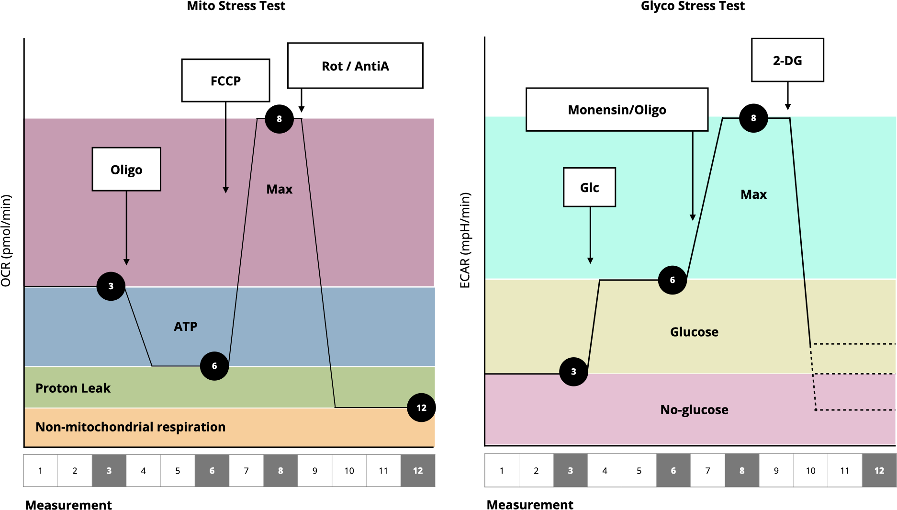

```{r, include = FALSE}
knitr::opts_chunk$set(
  collapse = TRUE,
  comment = "#>"
)
```

```{r setup}
library(ceas)
```

<!--Needed to load the mchem library for correct chemical equation rendering-->
<script>
window.MathJax = {
  tex: {
    // inlineMath: [['$', '$'], ['\\(', '\\)']],
    packages: {'[+]': ['mhchem']}
  },
  loader: {load: ['[tex]/mhchem']},
};
</script>
<script id="MathJax-script" async src="https://cdn.jsdelivr.net/npm/mathjax@3/es5/tex-mml-chtml.js"></script>
<!---->



\usepackage[version=4,arrows=pgf]{mhchem}
Proton production rate (PPR):

\[\text{PPR} = \frac{\text{ECAR value}}{\text{buffer}}\]

\[\text{PPR}_{\text{mito}} = \frac{10^{\text{pH}-\text{pK}_a}}{1+10^{\text{pH}-\text{pK}_a}} \cdot \frac{\text{H}^+}{\text{O}_2} \cdot \text{OCR}\]

Calculates the proton production from glucose during its conversion to
bicarbonate and \ce{H+} assuming max \(\frac{\ce{H}^+}{\ce{O2}}\) of 1

\[\text{PPR}_\text{glyc} = \text{PPR} - \text{PPR}_\text{resp}\]

\[
\ce{2H2 + O2 -> 2H2O}
\]

Calculates the proton production from glucose during its conversion to
\(\ce{lactate + H+}\).

Joules of ATP (JATP) production:

\[
\text{ATP}_{\text{glyc}} = \Bigl(\text{PPR}_\text{glyc} \cdot \frac{\text{ATP}}{\text{lactate}}\Bigl) + \Bigl(\text{MITO}_\text{resp} \cdot 2 \cdot \frac{\text{P}}{\text{O}_\text{glyc}}\Bigl)
\]

\[
\frac{\text{ATP}}{\text{lactate}} = 1
\]

with \(\frac{\text{P}}{{\text{O}_\text{glyc}}}\) = 0.167 for glucose
(0.242 for glycogen).

\[
\text{ATP}_\text{resp} =
 \Bigl(\text{coupled MITO}_\text{resp} \cdot 2 \cdot \frac{\text{P}}{\text{O}_\text{oxphos}}\Bigl) +
 \Bigl(\text{MITO}_\text{resp} \cdot 2 \cdot \frac{\text{P}}{\text{O}_\text{TCA}}\Bigl)
\]

with \(\frac{\text{P}}{{\text{O}_\text{oxphos}}}\) = 2.486 and
\(\frac{\text{P}}{{\text{O}_\text{TCA}}}\) = 0.167.

